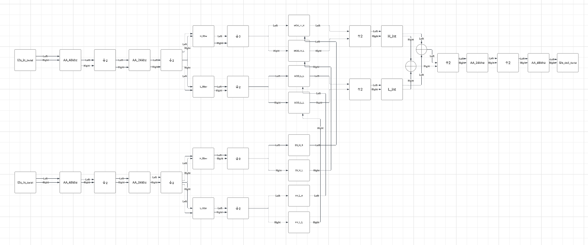

# FPGA Audio Multiband Processor

## Overview

This project implements a real-time digital audio processing chain on an FPGA using an **I2S audio interface**, **multirate FIR filtering**, and 2 **multiband signal paths**. The system receives stereo digital audio from the **ADC** on our board; those samples get processed on the FPGA and are transmitted back out over I2S.

The current design targets a Xilinx Artix-7 based development flow and was developed in **Vivado** using a mix of custom **VHDL** and Xilinx FIR Compiler IP cores.

At a high level, the project demonstrates:

* Real-time **I2S input and output** handling
* **Oversampled audio processing**
* **Anti-aliasing filtering** with 48 kHz and 24 kHz cutoff stages before rate changes
* **QMF (Quadrature Mirror Filter)** band splitting with FIR filters
* A practical FPGA-oriented filter-bank architecture
* Resource/performance tradeoffs for scaling to more bands

---
System Block Diagram

Figure: Current multirate multiband signal path, showing I2S input, anti-alias filtering, decimation, QMF splits, modulation/envelope stages, interpolation, reconstruction filtering, and I2S output.

## System Goal

The goal of this project is to build a flexible FPGA-based audio platform that splits incoming audio into frequency bands, processes those bands independently, and then reconstructs the signal for playback.

This playback signal path (1) will be modulated by another input signal (2). Signal input (2) will be a modulator for signal input (1). Meaning the gain and frequency pass-through will be determined by input (2), where the audio will be modulated and passed through from input (1).

This creates a foundation for features such as:

* Multiband dynamics processing
* Band-specific effects
* Adaptive spectral processing
* Audio analysis and control systems
* Future DSP experimentation in hardware

---
<h1>Hardware Box and Circuit Board</h1>

<table>
  <tr>
    <td align="center">
       
      <b>Hardware Box</b>
    </td>
    <td align="center">
       
      <b>Circuit Board</b>
    </td>
  </tr>
</table>
## Hardware Platform

This design is built around:

* **Basys 3 / Artix-7 FPGA platform**
* Digilent Pmod I2S2 audio interface for initial testing
* Up-clocking using PLLs to get from 24.576 MHz to 98.8 MHz
* External audio codec path for stereo input/output
* FPGA clocking for audio-domain timing and internal compute timing

The audio interface uses **I2S**, where stereo audio samples are transferred using:

* **BCLK / SCLK** for bit timing
* **LRCLK / WS** for left-right channel framing
* **SDIN / SDOUT** for serial audio data

The project uses **24-bit audio samples carried in 32-bit slots**, which is a common and practical format for I2S audio transport.
We used left-justified testing with the PMOD, but the Philips protocol was used with the integration with the board because of the ADC and DAC protocols.

---

## How the Project Works

## 1. I2S Receive

The FPGA first captures incoming stereo audio from the codec through a custom I2S receiver.

The receiver:

* Detects left and right channel boundaries from **LRCLK**
* Shifts in serial data using the I2S timing convention
* Reconstructs each audio word into parallel sample data
* Separates left and right channels for internal processing

Because I2S is serial, one of the most important parts of the design is correct **bit alignment** and **word timing**. The design follows the standard I2S convention, where the data is delayed by one bit clock relative to the LRCLK transition. This is consistent with the Philips protocol.

## 2. Internal Processing Path

Once samples are captured, they are routed through a multirate DSP chain made from FIR filters.

The present layout is based on:

1. **2 anti-alias filters**
2. **Downsampling / decimation**
3. **Band splitting**
4. Optional per-band processing
5. **Interpolation / upsampling**
6. Final anti-imaging filtering (reconstruction with AA filters)
7. I2S transmit back to the codec

This structure is efficient because lower-frequency bands can be processed at lower sample rates, reducing the number of operations required per second.
This would be a big part of Rev. 2 of this project, having it take the full computation time to allocate samples rather than running everything in parallel and not taking advantage of the extra time.

## 3. I2S Transmit

After processing, the samples are reformatted into the outgoing I2S stream and shifted back out to the codec.

The transmitter:

* Loads left and right sample words into output shift registers
* Aligns those words to the outgoing I2S frame timing
* Shifts the processed data out bit-by-bit
* Preserves stereo channel order and word timing

---

## Multirate Processing Strategy

A major strength of this design is that it does **not** process every band at the full original sample rate unless necessary.

Instead, the system uses **multirate DSP**, which means:

* Before reducing the sample rate, a lowpass **anti-alias filter** is applied
* Once the sample rate is reduced, lower-frequency content can be processed more cheaply
* Before reconstructing the signal, interpolation and output filtering restore the sample stream

This is one of the most important ideas in the project because it makes a hardware implementation much more realistic than trying to run every filter at the highest rate all the time.

---

## Aliasing Condition, Why It Is Being Relaxed, and Why It Is Acceptable

Aliasing occurs when signal content above the new Nyquist limit folds back into lower frequencies during downsampling.

For example, if the sample rate is reduced by 2, the new Nyquist frequency is also cut in half. Any energy above that new limit should ideally be removed before decimation, or it will fold into the passband and corrupt the result.

In an ideal multirate system, the aliasing condition is satisfied strictly before every decimation stage. In this project, the base split does **not fully satisfy that condition in the strict textbook sense**. There is still some spectral overlap around the crossover region when the signal is decimated.

So the most accurate way to describe the design is:

> the architecture allows some aliasing risk at the base filter layer, but the practical impact is limited by aggressive cutoff placement, strong overlap behavior, and the way the bands are reconstructed.

### Why this is acceptable in practice

Even though the alias condition is not being enforced perfectly at that stage, it is still acceptable for this design because:

* the crossover filters are intentionally aggressive
* the overlap region is narrow and controlled
* most of the energy that could fold is already strongly attenuated
* the remaining folded components are small enough to be tolerable in the intended application

So this is not a claim that aliasing is mathematically absent. It is a design tradeoff:

* strict alias-free splitting would require more filtering cost
* the present design accepts a controlled amount of alias interaction
* the audible and practical penalty is small enough to justify the hardware savings

That distinction is important. The system is not perfectly alias-free at that split. Instead, it is **engineered so that the amount of aliasing introduced is limited enough that it does not become a major problem**.

### Why the aggressive overlap helps

Because the crossover region is shaped aggressively, the band edges do not hand off abruptly. Instead, the filters overlap in a way that reduces the strength of unwanted edge artifacts. This means that even if the strict alias criterion is relaxed, the energy near the folding region is already reduced enough that the reconstructed result remains usable.

This is really a practical FPGA DSP compromise:

* not fully ideal in theory
* acceptable in implementation
* much cheaper than forcing a perfectly clean split everywhere

---

## Oversampling and Why It Helps

Oversampling is the main way to mitigate this issue more cleanly.

Rather than forcing extremely sharp filters at the first split stage, a better approach is to **oversample or keep a higher sample rate at the base filter layer**. Doing that creates more frequency space between the audio band of interest and the folding boundary.

### 1. More room for filter transition bands

When the sample rate is higher, the usable signal band occupies a smaller fraction of the total Nyquist range. That gives more room to design practical FIR filters with cleaner transitions.

### 2. Easier control of aliasing and imaging

With more spectral room, anti-alias and reconstruction filters do not need to be unrealistically sharp. That reduces implementation difficulty.

### 3. Better hardware tradeoffs

A well-planned oversampled chain can move demanding filtering stages into places where the filter requirements are easier to satisfy.

### 4. Cleaner multiband splitting

If the system is operating with margin above the final audio bandwidth of interest, the split bands can be designed with less overlap error and less risk of unwanted folding artifacts.

### Practical interpretation

The current design uses aggressive filtering and overlap to keep the aliasing penalty small enough to tolerate. A stronger next step would be to oversample at the base filter layer so that the same split can be achieved with more spectral margin and less folding risk.

That gives a useful progression:

1. Current system: acceptable practical tradeoff, but not strictly alias-free at the base split
2. Improved system: oversample the base filter layer to reduce the aliasing burden
3. Future system: combine oversampling with more efficient filter reuse or selective band splitting

In other words, **oversampling is the cleaner mitigation path**, especially at the earliest split where the alias condition is hardest to satisfy with limited hardware.

---

## Current Filter-Bank Layout

The current layout is effective for a smaller number of bands, but scaling it directly to **4 full bands across the entire spectrum** becomes expensive.

Why?

Because each additional full-range split typically requires:

* More FIR filters
* More adders and multipliers
* More routing
* More buffering and control logic
* More interpolation and decimation stages for reconstruction
* More timing pressure at higher clock rates

On an FPGA, this quickly increases usage of:

* DSP slices
* LUTs
* Registers
* BRAM
* Routing resources

It also makes timing closure harder and raises the risk of design complexity overwhelming the benefit.

---

## Why 4 Full Bands Is Too Much in the Current Layout

A straightforward 4-band implementation based on the current architecture would likely duplicate too much of the processing chain.

That means:

* Too many FIR instances active at once
* Too much parallel hardware
* Too much reconstruction overhead
* More complexity in managing latency matching between branches
* More opportunities for gain mismatch or boundary artifacts at crossover points

Even if the design fits, it may not be the best engineering choice because the added cost may not produce enough audible or functional benefit.

This is especially true when the lower bands are the ones that benefit most from narrow-band processing, while the upper bands often do not need the same level of subdivision.

---

## A Better Scaling Approach: Only Split the Low Bands

A more practical improvement is to **split only the low-frequency portion further**, instead of subdividing the entire spectrum uniformly.

This is a much better match for both signal behavior and hardware cost.

### Why this works

Low-frequency bands:

* Often need finer control
* Can be processed at lower sample rates after decimation
* Usually contain information where narrower band separation is more useful

High-frequency bands:

* Occupy a wider spectral region
* Often tolerate coarser grouping
* Are more expensive to split repeatedly because they stay at higher effective sample rates

### Suggested improvement

Instead of building four equal-style full-spectrum branches, a better structure is:

* First split the signal into **low** and **high**
* Keep the **high** branch as a single band
* Split the **low** branch again using a **QMF-style** or similar complementary filter pair
* Optionally continue only where the sample rate and band limits make the added hardware worth it

This gives a more practical multiband tree such as:

* Low-low
* Low-high
* High

or, with one more selective split:

* Sub-bass / low
* low-mid
* upper-mid / high

without forcing the entire spectrum through a full 4-way expansion.

---

## Why QMF-Based Low-Band Splitting Is Attractive

Using a **quadrature mirror filter (QMF)** or complementary low/high FIR pair for the low-frequency region is attractive because:

* The low band is already at a reduced sample rate
* FIR cost is lower at that point
* Complementary filters can reconstruct more cleanly
* You avoid paying the full hardware cost across the entire original bandwidth

This approach preserves most of the practical benefit of “more bands” while avoiding the worst resource growth.

It is a good compromise between:

* spectral control,
* reconstruction quality,
* and FPGA resource usage.

---

## Multiplexing to Improve Resource Usage

Another important path for improvement is **time multiplexing**.

Right now, the most direct implementation style is to dedicate hardware resources to each processing path in parallel. That is simple conceptually, but expensive.

A more efficient option is to reuse filter hardware across multiple channels or bands over time.

### Time-multiplexed idea

Instead of instantiating a separate FIR core for every branch, the FPGA can:

* store intermediate samples in buffers
* schedule different channels or bands into the same filter engine
* reuse multipliers and adders across multiple operations

### Why this helps

Multiplexing can reduce:

* DSP slice usage
* LUT usage
* BRAM duplication
* total instantiated IP count

This works especially well when:

* the system clock is much faster than the audio sample rate
* there is idle compute time between arriving samples
* latency constraints are moderate

### Tradeoff

The tradeoff is added control complexity:

* more scheduling logic
* buffer management
* stricter latency accounting
* potentially more complicated verification

But in a design like this, where audio sample rates are much lower than the FPGA compute clock, multiplexing can be a very strong optimization strategy.

---

## Why Multiplexing Makes Sense for This Project

This project already separates the audio-rate domain from the faster internal compute domain. That means there is an opportunity to do more work per incoming sample period than a purely sample-synchronous design would allow.

In practice, that means one well-designed processing block may be able to handle:

* left and right channels in sequence
* multiple band paths in sequence
* multiple filter stages in sequence

instead of duplicating all of them in hardware.

This is one of the most realistic ways to push toward more advanced band structures without immediately exhausting FPGA resources.

---

## Reconstruction Considerations

A multiband system is only useful if it reconstructs cleanly.

Key reconstruction concerns include:

* matched gain between branches
* complementary crossover behavior
* phase consistency
* equalized latency between paths
* proper interpolation and output filtering

If the filters are not complementary, the recombined signal can show:

* dips at crossover frequencies
* peaks at crossover frequencies
* phase cancellation
* summed gain errors

So a good multiband architecture is not just about splitting. It must also be designed so the branches add back together correctly.

---

## Practical Engineering Notes

Some important practical points for this project:

### Sample format

The design uses **24-bit audio carried in 32-bit words**, so care must be taken with:

* sign extension
* bit alignment
* truncation vs rounding
* gain staging between internal widths and output widths

### Clock-domain planning

Because the design uses audio clocks and a faster internal processing clock, reliable reset and signal handoff behavior matter. Good synchronization and deterministic framing are important.

### Fixed-point management

Every added band and every resampling stage increases the need for careful fixed-point scaling. Internal widths should be chosen to avoid unnecessary clipping while still keeping resource use reasonable.

### Latency accounting

Each FIR stage adds delay. A deeper multiband tree means the branches may no longer line up automatically. Delay matching is required before summation.

---

## Current Design Value

Even before expanding to more bands, the current design already demonstrates several important FPGA DSP concepts:

* serial audio interfacing with I2S
* real-time streaming dataflow
* FIR-based anti-alias and reconstruction filtering
* sample-rate conversion
* complementary band splitting
* hardware-conscious DSP architecture decisions

That makes the project valuable not just as an audio effect path, but also as a strong demonstration of practical digital signal processing on FPGA hardware.

---

## Future Improvements

Possible next steps include:

* Add per-band gain or dynamics control
* Implement time-multiplexed FIR processing
* Refine complementary crossover filter design
* Split only the low-frequency branch for improved resource efficiency
* Add cleaner latency compensation between branches
* Improve coefficient quantization and rounding strategy
* Add measurement workflows for crossover sum-flatness and phase matching
* Explore reusable filter-bank scheduling instead of fully parallel expansion

---

## Recommended Direction

The best next architectural improvement is likely:

1. Keep the current 2-band structure stable
2. Verify clean reconstruction and gain consistency
3. Add a second split only on the low-frequency branch
4. Use complementary FIR or QMF-based filters for that added split
5. Investigate time-multiplexing to reduce hardware duplication

This approach gives a meaningful step toward a richer multiband processor without committing to a costly full 4-band expansion across the entire spectrum.

---

## Conclusion

This project shows how a real-time FPGA audio system can combine I2S interfacing, oversampling, multirate FIR processing, and multiband signal decomposition in a practical hardware design.

The current system does not strictly satisfy the alias-free condition at the base split, but the design uses aggressive cutoff placement, controlled overlap, and practical reconstruction behavior to keep the penalty small enough to tolerate. Oversampling provides additional design margin that makes filtering and reconstruction more practical, and it is the clearest next step for reducing this alias burden. While a direct 4-band expansion of the current layout is too expensive in resources, there are realistic ways to scale the design, especially by splitting only the low bands further and by reusing processing hardware through multiplexing.

That makes the project a strong foundation for future FPGA-based audio DSP work.

---

## Author

Senior FPGA audio processing project focused on real-time I2S streaming, multirate FIR filtering, and efficient multiband architecture design.
